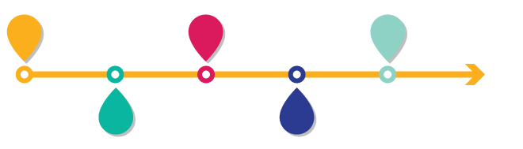

---

title: 'Introdução ao GIT'
theme: 'blood'
revealOptions:
  transition: 'slide'

---

## Introdução ao git

Autor: **Andrew Ribeiro**

---

#### Conteúdos

- O que é git?
- História
- Como funciona?
- Exemplos

---

## O que é git?

----

<!-- .slide: data-background-image="assets/project.jpeg" -->

De acordo com site oficial

> GIT é um sistema de controle de versão distribuido, gratuito e **opensource**
desenhado para lidar versionamento de pequenos a grandes projetos com rapidez e eficiência.

----

Controlar versões do projeto

---

### História

----
<!-- .slide: data-background-image="assets/belllabs.jpg" -->

## Bell Labs, 1972

Marc Rochkind criou o primeiro SCCS (Source Code Control System)

----

<!-- .slide: data-background-image="assets/primitive.jpeg" -->

### Muito primitivo

Apenas salvava um histórico

----

<!-- .slide: data-background-image="assets/centralized.png" -->

### Sistema de controle de versão centralizado

O mais famoso SVN (Subversion)

----

<!-- .slide: data-background-image="assets/distributed.jpg" -->

### Sistema de controle de versão distribuido

----

<!-- .slide: data-background-image="assets/distributed.jpg" -->

Em 2005, no desenvolvimento do Kernel do linux era mantido em  **BitKeeper**

----

<!-- .slide: data-background-image="assets/linusmad.jpg" -->

Linus Torvald deu início no próprio sistema de versionamento
## GIT

----

<!-- .slide: data-background-image="assets/linushappy.jpg" -->

Na gíria Britânica, **Git** significa _pessoa desagradável_.

> "Sou um egoísta bastardo. Nomeio todos meus projetos com algo relacionado a mim."

----

<!-- .slide: data-background-image="assets/distributed.jpg" -->

#### Atualmente, Git é uma das ferramentas mais usadas no mundo

---

## Como funciona?

----

<!-- .slide: data-background="rgb(244, 244, 244)" -->

Arquitetura Distribuida

----

<!-- .slide: data-background="rgb(244, 244, 244)" -->

Ambientes separados

---

## Exercícios
